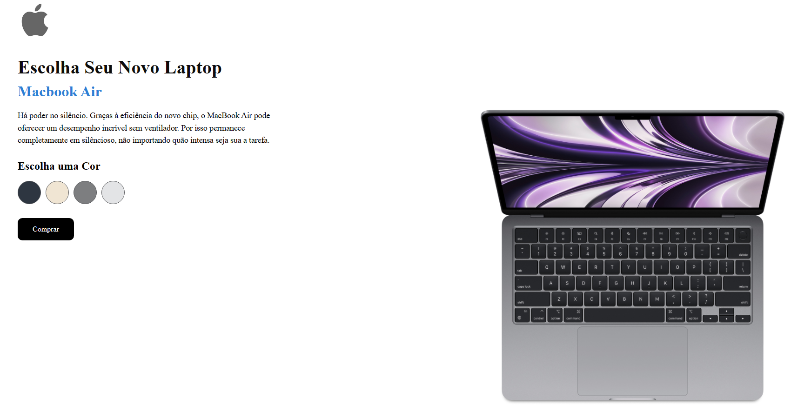
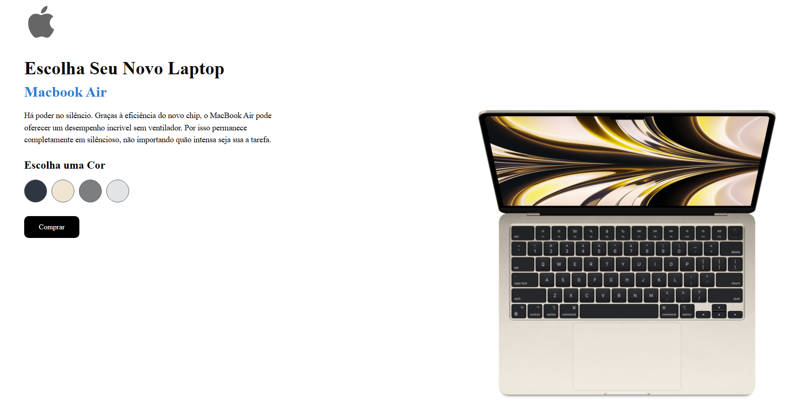

#
# 🌐Projeto Laptop Landing Page

Clique aqui para ver a página ao vivo:  https://laptop-lading-page.vercel.app/

#

## 📝 Sobre o Projeto

O projeto "Laptop Landing Page" é uma página de destino interativa e dinâmica para a compra de laptops. A característica principal desta página é a capacidade de visualizar o laptop em diferentes cores. Ao clicar na cor desejada, a imagem do laptop muda dinamicamente, proporcionando ao usuário uma experiência personalizada e envolvente.

## 💻 Tecnologias Utilizadas

Este projeto foi desenvolvido utilizando as seguintes tecnologias:

- **HTML5**: Utilizado para a estruturação do conteúdo da página.
- **CSS3**: Usado para estilizar a página, tornando-a visualmente atraente.
- **JavaScript**: Implementa a funcionalidade de mudança dinâmica da imagem do laptop com base na cor selecionada.

## 🚀 Como Usar

1. Clone este repositório para o seu computador.
2. Abra o arquivo `index.html` no seu navegador.
3. Interaja com o projeto
## 👤 Autor

#

## 🤝 Contribuições

#

## 📄 Licença

Este projeto está sob a licença MIT.
